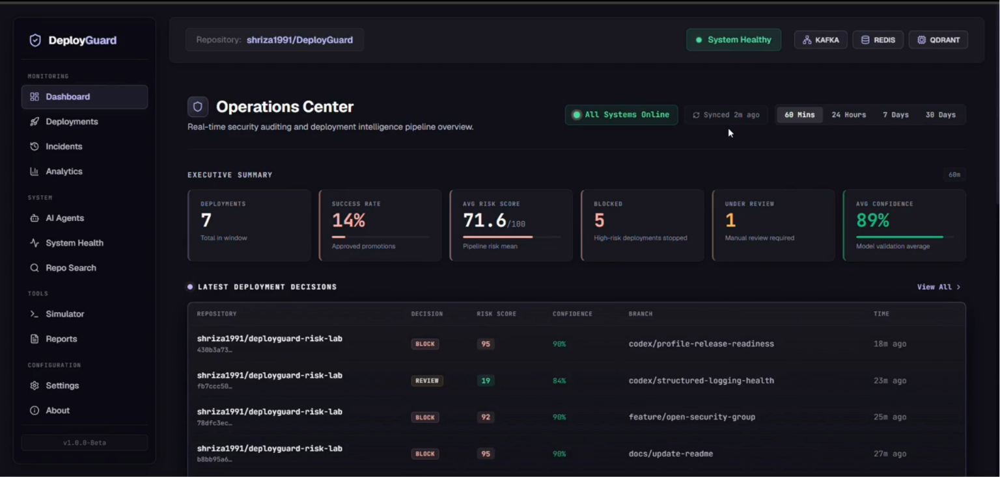
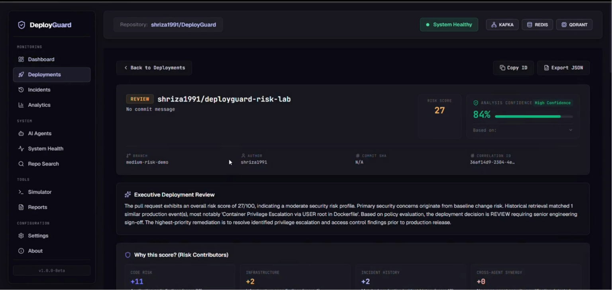
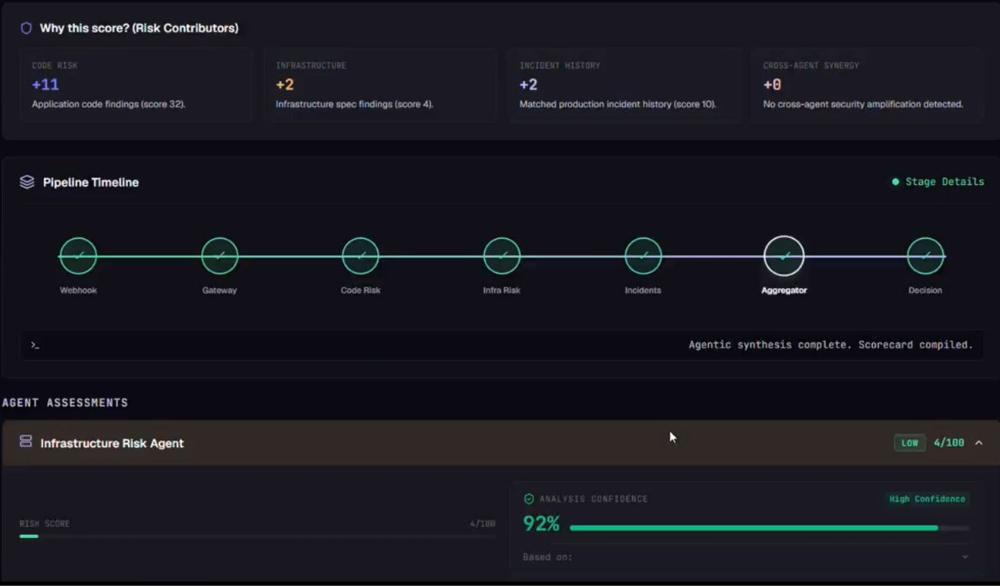
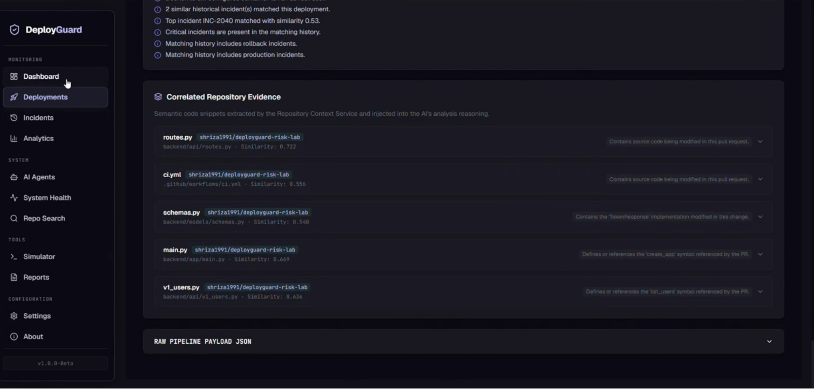
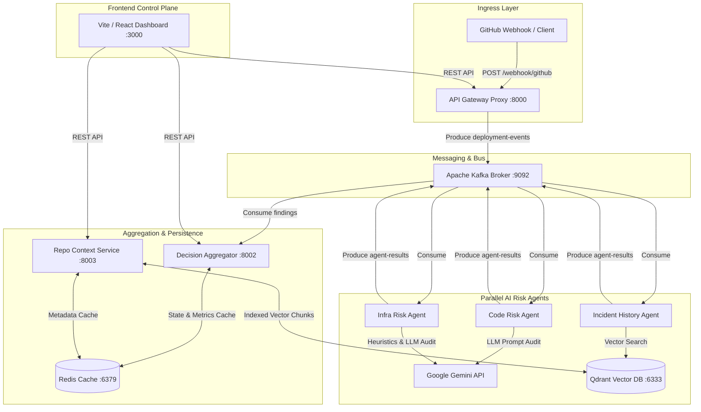

# DeployGuard

> **An agentic, pre-deployment risk gating and security intelligence platform that intercepts GitHub push events, runs multi-dimensional parallel AI audits, and computes automated release decision scorecards before code reaches production.**

DeployGuard is an autonomous DevSecOps control plane designed to eliminate high-risk production outages and credential leaks. By analyzing incoming pull requests and commits across static code vulnerabilities, infrastructure-as-code drift, and vector similarity against historical incidents, DeployGuard provides real-time risk gating with sub-second aggregation and explainable verdict scorecards.

---

## Table of Contents

- [Problem Statement](#problem-statement)
- [Solution](#solution)
- [Key Features](#key-features)
- [Screenshots](#screenshots)
- [Architecture](#architecture)
- [System Workflow](#system-workflow)
- [Tech Stack](#tech-stack)
- [Frontend Features](#frontend-features)
- [Backend Architecture](#backend-architecture)
- [API Overview](#api-overview)
- [Project Structure](#project-structure)
- [Installation](#installation)
- [Environment Variables](#environment-variables)
- [Demo Walkthrough](#demo-walkthrough)
- [Current Implementation Status](#current-implementation-status)
- [Future Improvements](#future-improvements)
- [Contributing](#contributing)
- [License](#license)

---

## Problem Statement

Modern software delivery relies on high-velocity Continuous Integration & Continuous Deployment (CI/CD) pipelines. However, traditional security practices create severe operational bottlenecks:

- **Slow Manual Reviews**: Senior engineers spend hours manually inspecting diffs for security risks, API key leaks, and configuration drifts.
- **Late Security Scanning**: Vulnerabilities are caught post-deployment or late in staging, increasing remediation costs.
- **Infrastructure Misconfigurations**: Minor Kubernetes or Terraform configuration drifts bypass code linting and trigger service downtime in production.
- **Ignored Outage History**: Teams rarely cross-reference current pull requests against past post-mortems and root-cause reports, causing recurring outage patterns.
- **Lack of Centralized Deployment Intelligence**: Platform teams lack a single operational view into deployment risk trends across microservices.

DeployGuard was built to solve these problems by automating pre-deployment risk gating through parallel AI agents and vector search.

---

## Solution

DeployGuard introduces a real-time risk evaluation pipeline that intercepts GitHub webhook events before code promotion:

```
[ GitHub Push Webhook ]
          │
          ▼
[ API Gateway Ingress (8000) ]
          │
          ▼
[ Kafka Message Event Bus ]
          │
    ┌─────┴───────────────────┬─────────────────────────┐
    ▼                         ▼                         ▼
[ Code Risk Agent ]    [ Infra Risk Agent ]    [ Incident History Agent ]
 (LLM Code Audit)      (IaC Drift Scanner)      (Qdrant Vector Lookup)
    │                         │                         │
    └─────┬───────────────────┴─────────────────────────┘
          ▼
[ Decision Aggregator (8002) ] ──► [ Redis State Store (6379) ]
          │
          ▼
[ Operations Dashboard (3000) ]
```

1. **Ingress Event Capture**: GitHub webhook payloads are validated by the API Gateway and queued in Kafka.
2. **Parallel Agent Evaluation**: Specialized microservices execute independent risk scans concurrently.
3. **Synthesis & Gating**: The Aggregator service collects agent findings, computes normalized risk scores (0–100) and confidence indices, and enforces release policies (`SAFE`, `REVIEW`, or `BLOCK`).
4. **Operational Visibility**: Results stream to the Executive Dashboard for instant operational awareness.

---

## Key Features

- 🤖 **Multi-Agent AI Risk Assessment**: Independent micro-agents specialize in static code auditing, infrastructure drift analysis, and incident correlation.
- ⚡ **Asynchronous Event Processing**: Built on Apache Kafka to handle high-throughput deployment webhooks asynchronously without blocking developers.
- 🧠 **Historical Incident Intelligence**: Semantic vector search matching proposed commits against a 50+ curated historical outage dataset using sentence-transformers and Qdrant.
- 📦 **Repository Context Indexing**: Deep semantic indexing of repository files, symbols, frameworks, and lines of code.
- 🔍 **Semantic Code Search**: Natural language vector query engine to discover patterns, classes, and logic across indexed repositories.
- 🛡️ **Infrastructure Security Analysis**: Automated scanning of Kubernetes manifests and Terraform configurations for root privileges, open ports, and resource drifts.
- 📊 **Real-time Operations Dashboard**: Polished operational view featuring 60-minute deployment windows, system health monitors, and live activity streams.
- 📉 **DevSecOps Analytics**: Time-series volume metrics, decision distribution charts, and risk histogram trends (7d / 14d / 30d / 90d).
- 🧪 **Webhook Simulator**: Built-in developer tool to simulate safe, warning, and critical GitHub push events with real-time pipeline execution tracking.
- 📄 **Compliance Report Generation**: Exportable DevSecOps summaries and raw pipeline registries in CSV and JSON formats.
- 🔔 **Reactive Real-time Alerts**: Non-blocking toast notifications for high-risk blocked deployments.

---

## Screenshots










## Architecture

The following diagram illustrates the complete DeployGuard distributed system architecture:



---

## System Workflow

```
1. Webhook Ingress    ──► 2. Event Streaming     ──► 3. Parallel Scanning   ──► 4. Vector Lookup
   (Gateway validates)     (Kafka topic produce)     (Code & Infra agents)     (Qdrant incident match)
                                                                                     │
8. History Archive    ◄── 7. UI Dashboard        ◄── 6. Policy Decision    ◄── 5. Score Aggregation
   (Permanent storage)     (React live view)         (SAFE / REVIEW / BLOCK)   (Aggregator synthesis)
```

1. **Webhook Ingress**: Developer pushes code or opens a Pull Request on GitHub. GitHub fires a webhook payload to API Gateway (`:8000`).
2. **Event Streaming**: Gateway parses and validates payload headers, wraps the payload in a `DeploymentEvent`, and publishes it to Kafka's `deployment-events` topic.
3. **Parallel Scanning**: 
   - **Code Risk Agent** extracts modified file diffs and prompts Gemini 2.5 Flash to detect credential leaks and code defects.
   - **Infra Risk Agent** analyzes Kubernetes and IaC files for privilege escalation and security drifts.
4. **Vector Lookup**: **Incident History Agent** embeds commit text using sentence-transformers and executes vector cosine similarity queries against Qdrant (`:6333`) to discover past outage parallels.
5. **Score Aggregation**: Aggregator (`:8002`) consumes all agent findings, normalizes scores to a 0–100 scale, and computes an overall confidence index.
6. **Policy Decision**: If `overall_score >= 60`, verdict is set to **`BLOCK`**; if `overall_score >= 30`, verdict is set to **`REVIEW`**; otherwise **`SAFE`**.
7. **UI Updates**: Decision is saved to Redis (`:6379`). Frontend (`:3000`) polls aggregator state and reactively updates dashboard cards and toast notifications.
8. **Permanent History**: The deployment evaluation record is stored permanently for auditing and analytics analytics.

---

## Tech Stack

### Frontend

| Component | Technology | Description |
|---|---|---|
| Framework | **React 18** | UI component architecture |
| Tooling | **Vite 8** | Lightning-fast build tool & dev server |
| Language | **TypeScript 5.8** | Type-safe application development |
| State & Query | **TanStack React Query v5** | Server-state caching and refetching |
| Routing | **React Router v7** | Single-page application client routing |
| Icons & Visuals | **Lucide React & Recharts** | Premium icon system & vector charts |
| Styling | **Vanilla CSS3** | Custom HSL tokenized dark glassmorphism system |

### Backend & Microservices

| Component | Technology | Description |
|---|---|---|
| Language | **Python 3.11** | Core backend language |
| Framework | **FastAPI & Uvicorn** | High-performance asynchronous REST APIs |
| Data Validation | **Pydantic v2** | Strict schema validation |
| Event Bus | **Apache Kafka** | Distributed message streaming broker |
| Caching & State | **Redis 7** | In-memory decision cache & metrics store |
| Vector DB | **Qdrant** | High-performance vector database |
| Embeddings | **Sentence-Transformers** | Local text embedding generation (`all-MiniLM-L6-v2`) |

### AI & LLM Integration

| Component | Technology | Description |
|---|---|---|
| LLM Provider | **Google Gemini API** | Advanced reasoning model |
| LLM Model | **Gemini 2.5 Flash** | Sub-second risk scoring & explainable reasoning |

### Infrastructure & Operations

| Component | Technology | Description |
|---|---|---|
| Containerization | **Docker & Docker Compose** | Multi-container service orchestration |
| Web Server | **Nginx** | Reverse proxy for frontend assets |

---

## Frontend Features

- 🎛️ **Dashboard (`/`)**: Operational hub featuring a 6-card Executive Summary, a focal Latest Deployment Decisions table (filtered to 60-minute windows), Repository Context metadata, Pipeline System Health, Live Recent Activity feed, and AI Agent Fleet overview.
- 🚀 **Deployments (`/deployments`)**: Full deployment audit table with search by repository or ID, filter dropdowns (Decision, Severity, Branch), pagination, correlation ID copying, and JSON data exports.
- 🔎 **Deployment Details (`/deployments/:id`)**: Deep inspection view rendering overall risk score bar, confidence displays, free-text AI intelligence summary, collapsible per-agent findings, correlated repository evidence snippets, raw decision JSON viewer, and step-by-step audit timelines.
- 📈 **Analytics (`/analytics`)**: DevSecOps analytics center rendering time-range selectors (7d/14d/30d/90d), daily deployment volume bar charts, decision distribution pie charts, risk score trend area charts, severity filterable block logs, and CSV data export downloads.
- 🤖 **AI Agents (`/agents`)**: Agent fleet monitoring page detailing active worker counts, fleet average confidence, total evaluation metrics, per-agent hardware load (CPU, RAM, uptime, latency), and sample console log streams.
- 💥 **Incidents (`/incidents`)**: Historical Incident Intelligence dashboard rendering an expandable outage database (Root Cause, AI Summary, Resolution, Rollback Status) alongside a semantic vector similarity search playground.
- ⚡ **System Health (`/system-health`)**: Pipeline infrastructure health page tracking real-time status of Gateway, Aggregator, Kafka, Redis, and Qdrant service nodes, latency metrics, and network orchestration telemetry.
- 🧪 **Webhook Simulator (`/simulator`)**: Developer testbed to trigger simulated GitHub webhook pushes with pre-loaded templates (Safe, Warning, Critical) and real-time execution progress tracking.
- 📑 **Reports (`/reports`)**: Compliance export hub offering report templates (Executive Summary, Agent Reliability, Raw JSON) with customizable time windows and automated browser downloads.
- ⚙️ **Settings (`/settings`)**: Session policy configurator with interactive sliders for Auto-Block threshold scores, Review limits, agent timeouts, Slack/Email alert toggles, and visual theme preferences.
- 🔍 **Repository Search (`/search`)**: Natural language semantic code search querying Qdrant vector space across indexed repository chunks, highlighting file paths, line ranges, and similarity scores.
- ℹ️ **About (`/about`)**: Architecture documentation page rendering platform concepts, visual ASCII pipeline flowcharts, sub-agent security profiles, and tech stack references.

---

## Backend Architecture

```
DeployGuard Microservices
├── Gateway Proxy (:8000)               ── Ingress validation & Kafka event publishing
├── Aggregator Engine (:8002)            ── Decisions compilation, Redis state & metrics
├── Repository Context Service (:8003)   ── Vector indexing, chunking & semantic search
├── Code Risk Agent                     ── Static diff scanning & Gemini security audit
├── Infra Risk Agent                    ── IaC drift detection & Gemini security audit
└── Incident History Agent             ── Qdrant vector embedding & outage matching
```

### 1. Gateway Proxy (`gateway/`)
- Ingress gateway for external webhooks.
- Validates GitHub webhook signatures and payload contracts.
- Wraps incoming events into standard `DeploymentEvent` schemas and produces them to Kafka.

### 2. Decision Aggregator (`aggregator/`)
- Central decision engine of DeployGuard.
- Consumes agent evaluation findings from Kafka topics.
- Synthesizes risk scores into final decisions (`SAFE`, `REVIEW`, `BLOCK`).
- Manages 60-minute window metric filters and persists state to Redis.
- Serves REST endpoints for frontend dashboard queries.

### 3. Repository Context Service (`repository-context-service/`)
- Indexes repository source files, generates line chunks, and computes vector embeddings.
- Stores vector payloads in Qdrant and caches metadata in Redis.
- Exposes semantic search endpoints for code lookup and evidence retrieval.

### 4. AI Risk Agents (`agent-*/`)
- **Code Risk Agent**: Scans pull request title, body, commit message, and modified diffs for security bugs and exposed secrets using Google Gemini API.
- **Infra Risk Agent**: Scans Kubernetes YAML and Terraform configs for security misconfigurations and root privilege escalations using Google Gemini API.
- **Incident History Agent**: Computes vector embeddings using `sentence-transformers` and queries Qdrant to find matching historical outages.

---

## API Overview

### Ingress & Gateway
- `POST /webhook/github` — Webhook ingress endpoint for GitHub push events.

### Decision & Deployments Aggregator
- `GET /health` — Aggregator health check.
- `GET /deployments` — Paginated list of deployment evaluation records.
- `GET /deployments/metrics` — Aggregate pipeline metrics (total, safe, review, blocked, avgRisk, avgConfidence).
- `GET /decision/{correlation_id}` — Fetch single deployment verdict or pending evaluation status.
- `GET /agents/status` — Agent fleet health, latency, analysis counts, and confidence averages.

### Repository Context
- `GET /repository/status/{repo}/{branch}` — Indexing status of a repository branch.
- `GET /repository/stats/{repo}/{branch}` — File counts and lines of code statistics.
- `GET /repository/manifest/{repo}/{branch}` — Detected frameworks and last indexed timestamp.
- `POST /repository/search` — Vector search over indexed codebase chunks.

### Analytics & Incidents
- `GET /analytics/summary` — High-level DevSecOps analytics statistics.
- `GET /analytics/volume` — Daily volume time-series metrics.
- `GET /analytics/decisions` — Decision breakdown distribution percentages.
- `GET /analytics/blocks` — Filtered log of blocked deployments.
- `GET /analytics/export` — Download CSV or JSON analytics export.
- `GET /incidents` — Curated historical incident dataset.
- `POST /incidents/similarity` — Perform vector similarity lookup for commit text against historical incidents.

---

## Project Structure

```
DeployGuard/
├── agent-code-risk/                 # Code Risk AI Agent (FastAPI + Gemini)
├── agent-infra-risk/                # Infra Risk AI Agent (FastAPI + Gemini)
├── agent-incident-history/          # Incident History Agent (FastAPI + Qdrant)
│   └── incident_seeding/            # Curated 50+ incident dataset & embeddings
├── aggregator/                      # Decision Aggregator Service & REST API
├── gateway/                         # GitHub Webhook Ingress Gateway Proxy
├── repository-context-service/      # Code Indexing & Semantic Vector Search
├── frontend/                        # Vite + React + TypeScript Dashboard
│   ├── src/
│   │   ├── api/                     # Type-safe Axios client modules
│   │   ├── components/              # Shared UI components (MetricCard, StatusBadge, etc.)
│   │   ├── pages/                   # 12 Application pages
│   │   └── utils/                   # Confidence normalization & time helpers
│   ├── public/                      # Static branding assets
│   └── package.json
├── docker-compose.yml               # Multi-container orchestration specification
├── .env.example                     # Environment template
└── README.md                        # Project documentation
```

---

## Installation

### Prerequisites

- **Docker & Docker Compose**: Docker Desktop 4.20+ or Docker Engine 24.0+
- **Node.js**: v18.0+ (if running frontend locally outside Docker)
- **Python**: 3.11+ (if running backend services locally outside Docker)
- **Google Gemini API Key**: Free or paid API key from Google AI Studio

### Step 1: Clone Repository

```bash
git clone https://github.com/shriza1991/DeployGuard.git
cd DeployGuard
```

### Step 2: Configure Environment Variables

Copy `.env.example` to `.env` and set your Gemini API key:

```bash
cp .env.example .env
```

Edit `.env`:

```env
GEMINI_API_KEY=your_actual_gemini_api_key_here
GEMINI_MODEL=gemini-2.5-flash
```

### Step 3: Launch Containers via Docker Compose

```bash
docker-compose up --build -d
```

Verify that all containers are healthy:

```bash
docker-compose ps
```

---

## Environment Variables

| Variable | Required | Default | Description |
|---|---|---|---|
| `GEMINI_API_KEY` | **Yes** | — | API key for Google Gemini LLM security audits |
| `GEMINI_MODEL` | No | `gemini-2.5-flash` | Gemini model variant to use |
| `KAFKA_BROKER` | No | `kafka:9092` | Bootstrap address for Kafka broker |
| `REDIS_URL` | No | `redis://redis:6379/0` | Connection URI for Redis cache |
| `QDRANT_URL` | No | `http://qdrant:6333` | Connection URL for Qdrant Vector Database |

---

## Demo Walkthrough

Follow this step-by-step walkthrough to demonstrate DeployGuard during a presentation:

1. **Start Services**: Launch all microservices using `docker-compose up --build -d`.
2. **Open Dashboard**: Navigate to `http://localhost:3000` in your browser to view the **Operations Center**. Observe that all services display **ONLINE**.
3. **Open Webhook Simulator**: Click **Simulator** in the sidebar navigation (`http://localhost:3000/simulator`).
4. **Load Critical Preset**: Click the **🔴 Load Critical Preset** button. Notice the form fills with a high-risk PR (`hotfix: disable security policies temporarily`).
5. **Trigger Simulation**: Click **Send GitHub Webhook Push Event**. Observe the live stage execution progress bar evaluating Kafka delivery, Code Risk, Infra Risk, Incident History, and Aggregator decision.
6. **Inspect Verdict**: Upon completion, you will be automatically redirected to the **Deployment Details** page (`/deployments/:id`). Inspect the **`BLOCK`** verdict badge, overall risk score (80+), AI risk summary, and individual agent scores.
7. **View Incidents Intelligence**: Open **Incidents** (`/incidents`) to browse the 50+ outage database and test vector similarity matching against custom commit descriptions.
8. **Explore Analytics**: Navigate to **Analytics** (`/analytics`) to review volume trends, decision distribution pie charts, and export a CSV report.
9. **Semantic Search**: Navigate to **Repo Search** (`/search`) and type `"Redis client initialization"` to query indexed code chunks.

---

## Current Implementation Status

- [x] **Operations Center Dashboard**: Executive summary cards, focal deployment table, pipeline health grid, live activity stream.
- [x] **Deployment Audit Archive**: Paginated list of deployments with multi-field search and filters.
- [x] **Deployment Details**: Full single-deployment breakdown with agent scores, evidence snippets, raw JSON, and timeline.
- [x] **DevSecOps Analytics**: Interactive charts for deployment volume, decision distribution, and risk histograms with CSV exports.
- [x] **AI Agent Monitoring**: Real-time worker fleet health, latencies, analysis counts, and sample log output streams.
- [x] **Incident Intelligence**: Outage database browser with expandable details and vector similarity matching against Qdrant.
- [x] **Webhook Simulator**: Interactive testbed with pre-loaded presets and pipeline evaluation tracking.
- [x] **Semantic Code Search**: Qdrant-backed natural language search over indexed codebase chunks.
- [x] **Compliance Reports**: Downloadable CSV and JSON report exports.
- [x] **Repository Context**: Automated indexing of file counts, LOC, frameworks, and last indexed timestamps.
- [x] **Pipeline System Health**: Real-time monitoring of Gateway, Aggregator, Kafka, Redis, and Qdrant service nodes.

---

## Future Improvements

- 🔄 **Live Streaming Agent Logs**: WebSockets / Server-Sent Events (SSE) integration for streaming real-time agent execution logs.
- 🔐 **Authentication & RBAC**: User authentication, team workspaces, and role-based access control (Admin, SRE, Developer).
- 🐙 **GitHub App Integration**: Direct integration as an official GitHub App to automatically post check runs and PR comments.
- ⚡ **Multi-Repository Indexing**: Concurrent indexing for multi-repo enterprise microservice architectures.
- 📜 **Custom Policy Engine**: Configurable OPA / Rego policy rules for enterprise-specific risk gating thresholds.

---

## Contributing

Contributions are welcome! Please follow these steps:

1. Fork the repository (`https://github.com/shriza1991/DeployGuard/fork`).
2. Create a feature branch (`git checkout -b feature/amazing-feature`).
3. Commit your changes (`git commit -m 'feat: add amazing feature'`).
4. Push to the branch (`git push origin feature/amazing-feature`).
5. Open a Pull Request.

---

## License

This project is licensed under the MIT License — see the [LICENSE](LICENSE) file for details.